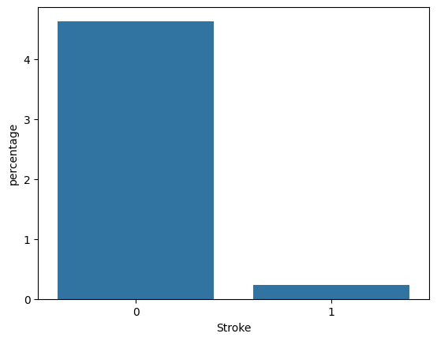
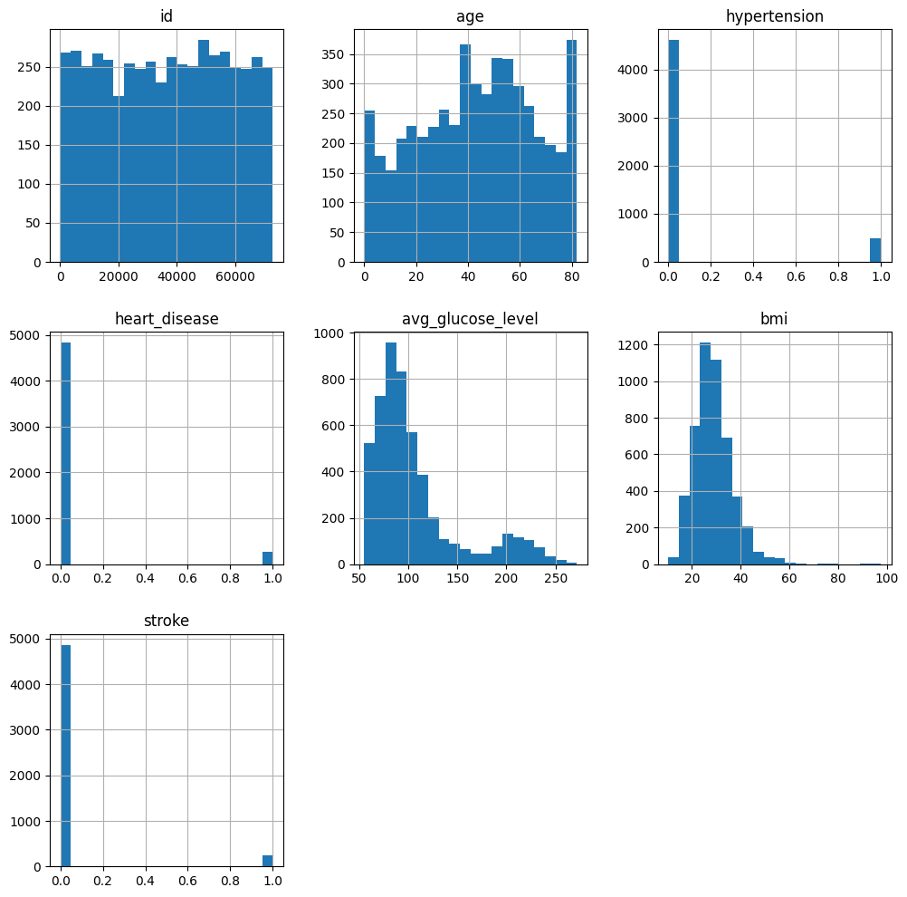
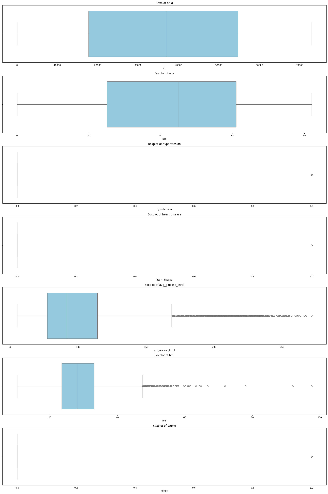
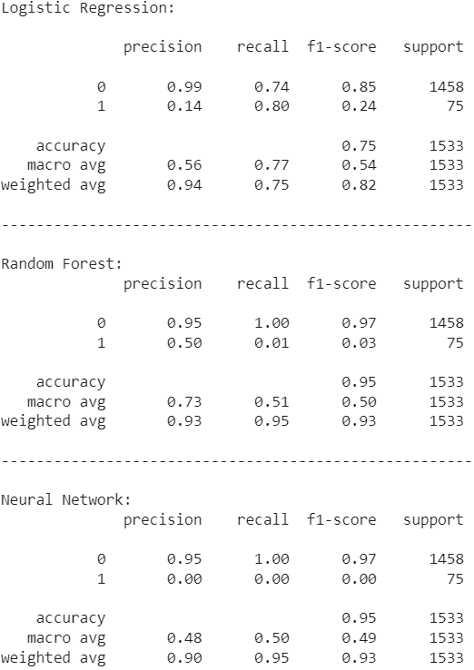

# **Stroke Prediction Machine Learning Model**
### **BRAC University - Artificial Intelligence**  

**CSE422 Section 4**

**Spring 2025**  
**Lab Project Report**

*Submitted by*
- 22301068 Mushfique Tajwar 
- 22301130 Aryan Rayeen Rahman

### **Table of Contents**
**[1. Introduction](#introduction)**

**[2. Dataset Description](#dataset-description)**

- [Dataset Analysis](#dataset-analysis)
  
- [Imbalanced Dataset](#imbalanced-dataset)
  
-  [Other Exploratory data analysis](#other-exploratory-data-analysis)

**[3. Dataset Pre-Processing](#dataset-pre-processing)**

**[4. Dataset Splitting](#dataset-splitting)**

**[5. Model Training and Testing](#model-training-and-testing)**

**[6. Model selection/comparison analysis](#model-selection/comparison-analysis:)**
  
- [Bar chart showcasing the prediction accuracies of all models](#bar-chart-showcasing-the-prediction-accuracies-of-all-models)
  
- [Precision, recall comparison of each model](#precision,-recall-comparison-of-each-model)
  
- [Confusion Matrix](#confusion-matrix)
  
- [AUC score, ROC curve](#auc-score,-roc-curve)
  

**[7. Conclusion](#conclusion)**

# **Introduction**

Our project predicts whether a person is prone to having a stroke using machine learning models. We train these models by utilizing a dataset consisting of 5,110 entries containing the features ID, gender, age, hypertension, heart disease, marital status, work type, residence type, average glucose level, BMI and smoking status. We retrieve and analyze all the necessary data from the given dataset and preprocess the data wherever we see some scopes of improvement and modifications for the dataset then train some machine learning models on the modified dataset and then showcase their prediction accuracy and come to a conclusion.

# **Dataset Description**

* ## **Dataset Analysis**

    
  * **Features:** There are 12 features in our dataset, including the target stroke.   
      
  * **Problem Type:** Our problem type is classification because the target column, stroke, is categorical with classes 0 and 1  
      
  * **Data Points:** There are 5110 entities/rows in the dataset.  
      
  * **Kind of features:** There are both quantitative (numerical) and categorical features.  
    *  **7 numerical** features ('id', 'age', 'hypertension', 'heart\_disease', 'avg\_glucose\_level', 'bmi', 'stroke') .  
    *  **5 categorical** features ('gender', 'ever\_married', 'work\_type', 'Residence\_type', 'smoking\_status').  
      

      
  * **Correlation Analysis:**   
      
    * No strong positive or negative correlations were observed between the numerical features and the target.  
    * Most features have very low correlation with each other and also with “stroke”(target).

Figure 1: Heat map for correlation matrix

Figure 2: Pearson, Spearman and Kendall correlation methods.

We can infer from the 2 heat maps that there are no negative values and none of the features are correlated and it is possible to get a good predictive performance from this dataset. 

* ## **Imbalanced Dataset**

Figure 3: Density plot of Numerical features.

From the bar chart we can see an imbalance in the target i.e. Stroke.

* ## **Other Exploratory data analysis**

Figure 4: Density plot of Numerical features.

From the above figure of density plot we can see which of the entries of each numerical feature carry the most weight to determine the skewness. Here we can see that the features \- heart disease, average glucose level, hypertension and BMI are skewed.

Figure 5: Histogram of numerical features.

Just like the density plot, this histogram figure also shows which of the entries of each numerical feature carry the most weight to determine the skewness. Here we can see that the features \- heart disease, average glucose level, hypertension and BMI are skewed.

Figure 6: Boxplot of numerical features.

From the above box plot we can see that there are a lot of outliers in the features average glucose level and BMI.

# **Dataset Pre-Processing:**

* **Null/Missing values:** There are only null values in the “bmi” column. So, we impute those values with the strategy \= “median” of that column.  
    
* **Categorical values:** There are 2 categorical variables in the dataset ('gender', 'smoking\_status'). We map them to format it into numerical in the following manner: For gender, Other : 2, Male : 1, Female : 0 and for smoking status, Unknown : 3, smokes : 2, formerly smoked : 1, never smoked : 0\.  
    
* **Feature Scaling:** As there are a lot of outliers (from box plot) and bias (from data density plot/histogram), scaling is done using Robust Scaler.

# **Dataset Splitting**

● Train set (70%)

● Test set (30%) \[test size= 0.3\]

● Random \= 5 state ensures reproducibility so that we get the same split every time we run our models. Stratified is also used as there is imbalance in the dataset. 

# **Model Training and Testing**

We applied Logistic Regression, Random Forest and Neural Networks models using the Sci-kit learn library to train our model.

# **Model selection/comparison analysis**

* ## **Bar chart showcasing the prediction accuracies of all models**

|     Logistic Regression Accuracy \- | 73.97% |
| ----: | :---- |
|           Random Forest Accuracy \- | 94.92% |
| Neural Network Accuracy \- | 95.11% |

Figure 7 : Barchart comparing the prediction accuracy of the models used.

* ## **Precision, recall comparison of each model**

Figure 8 : Precision, Recall and F1-Score of the models used.

* ## **Confusion Matrix**

Figure 9 : Confusion matrix of Logistic Regression

From this confusion matrix of Logistic Regression we get that the model detected 1086 True Negatives (TN), 372 False Positives (FP), 15 False Negatives (FN) and 60 True Positives (TP).  

Figure 10 : Confusion matrix of Random Forest

From this confusion matrix of Random Forest we get that the model detected 1457 True Negatives (TN), 1 False Positives (FP), 74 False Negatives (FN) and 1 True Positives (TP).  

Figure 11 : Confusion matrix of Neural Network

From this confusion matrix of the Neural Network we get that the model detected 1458 True Negatives (TN), 0 False Positives (FP), 75 False Negatives (FN) and 0 True Positives (TP).

* ## **AUC score, ROC curve**

Figure 12 : AUC scores and ROC curves for the models implemented.

From this figure we can see that Logistic Regression is the top performer based on ROC curve and AUC, closely followed by Random Forest and at the last place we have Neural Network.

# **Conclusion**

From our evaluation, we observed that the Random Forest model was the best performer throughout most the tests and second best in ROC curve and AUC score and the Neural Network had the same accuracy but its AUC score was lowest and its ROC curve was also the worst but it has the same precision, recall and F1-score with Random Forest. And lastly, even though Logistic Regression has the highest AUC score and the best ROC curve, its accuracy, precision, recall and F1-score was the worst among all the models. Neural Network is a complex model, our dataset might be insufficient for it but it still gives a good accuracy and AUC. The dataset had to be carefully pre-processed as there were null values which were imputed using median, categorical values encoded to numeric and some irrelevant columns which were dropped. There is imbalance in the dataset as the number of people prone to stroke are highly skewed. So a resampling of data might give a better performance in the models. Nonetheless, our study highlights the potential of predicting stroke in order to prevent such from happening to people.